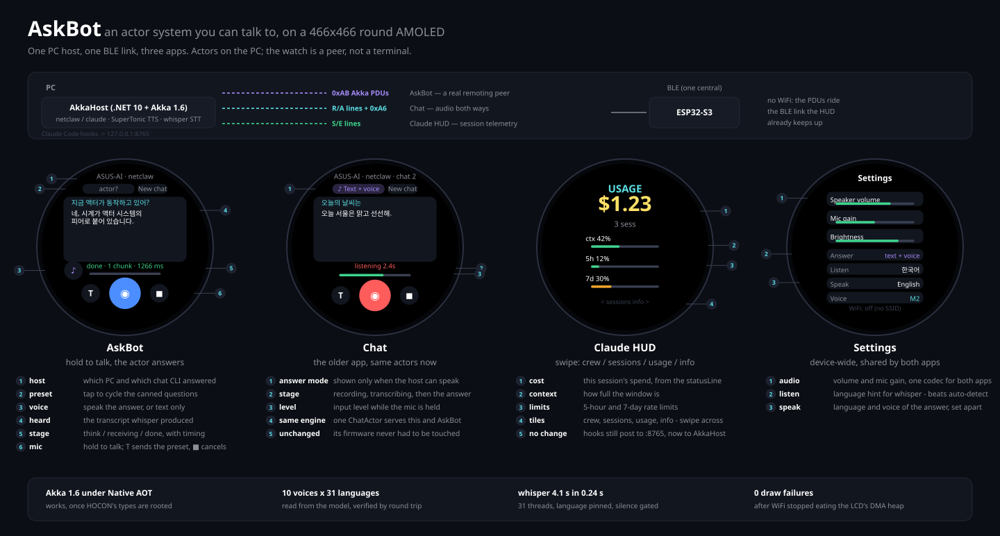

# akka — an ESP32-S3 as a peer in a .NET Akka actor system



<sub>Drawn from the real LVGL layouts by <code>tools/gen_hero_svg.py</code>; regenerate it when a
screen moves.</sub>

The device joins a .NET 10 `ActorSystem` over Akka.NET classic remoting and takes
part as a **client actor**: it has an address, the host `Tell`s it, and it answers.
The question this sample exists to settle is whether the actor model is usable from
a small device at all.

```
[ESP32-S3-Touch-AMOLED-1.75C]                        [PC]  host/  AkkaHost.exe
                                                     .NET 10 + Akka 1.6
 AskBot app     Akka PDUs --0xAB--\                   BleLink (owns the single BLE link)
 Chat app       R/A lines, 0xA6 ---+-- one BLE link --+-- BleTunnel ---> TCP 2552 -> /user/chat
 Claude HUD     S/E lines --------/                    +-- BleChatProxy -----------> ChatActor
                                                       +-- HudActor <- :8765 <- Claude Code
 Settings app (WiFi service, off by default)                        chat CLI + SuperTonic + whisper
```

One host, one link, all three apps. AskBot is a real remoting peer whose PDUs are tunnelled over
BLE; the Chat app keeps its line protocol and a proxy actor turns it into the same messages.
Neither firmware app needed changing for that, and there is no WiFi anywhere in the path.

## Status

| | |
|---|---|
| Akka.Remote under Native AOT | **works** for the remoting core, with two workarounds (below); the BLE central pulls in WinRT, so AOT is unverified since |
| C++ peer: associate, heartbeat, tell/ask | **verified** on the PC, both JIT and AOT hosts |
| Chat flow (hello / text / streamed reply / cancel / newsession) | **verified** end to end, offline `echo` provider |
| Spoken answers (SuperTonic → ADPCM → `byte[]` messages) | **verified** end to end, inside the AOT binary too |
| On the watch: AskBot associates and speaks | **verified on hardware** over BLE, no WiFi |
| On the watch: the Chat app served by the same actors | **verified on hardware** (same answer, same voice) |
| Microphone → STT (Whisper) | **verified on hardware** from both apps - AskBot has its own hold-to-talk button |
| Voice settings on the watch (listen / speak / voice) | **verified on hardware**: `spoke #1 as M2/en` |
| Claude HUD app served by the same host | **verified on hardware**: `rx S 205 bytes -> ok` |
| AskBot's own agent (LLM + tools on this PC) | **verified**: `find_music` → `play_music` plays, `list_drives` answers in Korean; the watch is routed to it (`said hello as askbot, answered by agent:gemma-4-e4b`) |

```powershell
pwsh -File project/samples/akka/run_test.ps1        # framework-dependent host
pwsh -File project/samples/akka/run_test.ps1 -Aot   # Native AOT host
```

Three layers run: `askbot_cli` for the raw protocol, `askbot_chat` for the
conversation flow, and the spoken answer (`--tts`), which is decoded back to a WAV so
it can be listened to. No board and no LLM required; `-NoVoice` skips the audio leg.

## Making Akka.NET work under Native AOT

Two things break, and the failures are not obvious from the analyzer warnings:

**1. HOCON loads types by name.** `akka.actor.provider = remote` becomes
`Type.GetType("Akka.Remote.RemoteActorRefProvider, Akka.Remote")`. Nothing
references it statically, so the trimmer drops it and the published binary dies at
startup:

```
Akka.Configuration.ConfigurationException: 'akka.actor.provider' is not a valid
type name : 'Akka.Remote.RemoteActorRefProvider, Akka.Remote'
```

Fix: root the assemblies (`AskBot.Host.csproj`) — `Akka`, `Akka.Remote`,
`Newtonsoft.Json`, `Google.Protobuf`, `DotNetty.*`. Cost: 3.6 MB → 26.3 MB.

**2. `Props.Create<T>()` is reflection.** Every overload in 1.6 — *including* the
`Props.Create(() => new T())` lambda form, which is decomposed into a
`NewExpression` plus arguments — ends at `ActivatorProducer`, i.e.
`Activator.CreateInstance`:

```
MissingMethodException: No parameterless constructor defined for type 'AskActor'
```

Fix: `Props.CreateBy(IIndirectActorProducer)` with a producer that closes over a
real `new` — see `AotProps.cs`. That is the one creation path with no reflection in
it.

With those two, remoting starts, associates, serializes and round-trips inside a
single 26 MB exe. Upstream's own AOT epic
([akka.net#7246](https://github.com/akkadotnet/akka.net/issues/7246)) is still open
against the 1.6 milestone, and its remaining items are what these workarounds paper
over. `PublishAot` is therefore opt-in: `-p:AskBotAot=true`.

Akka 1.6 itself is nightly-only — nuget.org's latest stable is 1.5.71 (2026-08-27),
so `host/nuget.config` adds the official feedz.io feed and the project pins
`1.6.0-beta20260912000155`.

## Speech

Answers can come back as audio. The host synthesizes with **SuperTonic-3** - four ONNX
graphs through `Microsoft.ML.OnnxRuntime`, no Python, no espeak-ng, no COM - resamples
44.1 kHz to 16 kHz, encodes IMA ADPCM and pushes one block per `byte[]` message
(serializer 4). The device decodes into PSRAM and plays the utterance when the host says
it is complete.

The model is the one **AgentZeroLite already installed** under
`%LOCALAPPDATA%\AgentZeroLite\models\supertonic` (383 MB, 10 voices, 31 languages).
This project never downloads it; if it is absent, `hostinfo` reports `tts:false`, the
device hides its voice toggle, and answers stay text - the same degradation the BLE host
applies.

Measured on this machine: ~0.9 s one-time model load, ~4 s of CPU for ~20 s of Korean
audio at 8 denoising steps. It also runs **inside the Native AOT binary** (27.6 MB exe
plus a 13.5 MB native `onnxruntime.dll`), which is the reason SuperTonic was the right
choice: Windows `System.Speech` is COM-based and does not survive AOT at all.

Try it without any of the rest:

```powershell
AskBot.Host.exe --speak "안녕하세요. 액터 모델로 대답합니다." --out hello.wav
```

## Speech in

The Chat app's microphone now reaches the same actors: `voice` / `0xA5` frames / `end` →
ADPCM decode → **whisper.cpp** (`ggml-small.bin`, already installed by AgentZeroLite) →
the transcript goes back to the watch as an `stt` stage and then straight into the normal
answer path. Since both apps share `ChatActor`, AskBot inherits this the moment it grows a
mic button.

Two findings worth keeping:

- whisper.cpp's default thread count turned a 4.1 s capture into **25.6 s** of work. Pinned
  to `ProcessorCount - 1` threads with the language fixed rather than auto-detected it is
  **2.3 s** cold and **0.24 s** warm.
- On a quiet capture whisper invents text (`[구독 / 좋아요]`, `[감사합니다]`), which the
  watch would then send to the LLM as a question. A level gate stops that: a quiet room here
  measures peak -46.8 dBFS / rms -58.9 dBFS, so anything below the thresholds returns
  "no speech detected" without ever loading the audio into the model.

`AkkaHost.exe --talk 4000` asks the watch to record for four seconds on connect - how this
was tested without touching the device.

## The Claude HUD rides along

The third app on the link shows what a Claude Code session is doing. Its firmware consumes
`S` (statusLine) and `E` (hook event) lines, which `hud_ble` handles itself - so the device
needed no change at all; what changed is who writes them.

`AkkaHost` keeps the contract `claude_hud_amoled/pc/ble_bridge.py` established, byte for byte:

```
POST http://127.0.0.1:8765/status   {json}   ->  "S {json}"  to the watch
POST http://127.0.0.1:8765/event    {json}   ->  "E {json}"
GET  http://127.0.0.1:8765/health
```

So the hooks already installed in `~/.claude/hud_amoled` keep working and `settings.json` is
untouched. `HttpListener`, three routes, no ASP.NET. The lines go out through a `HudActor` so
that a statusLine update and a hook event arriving on different HTTP threads serialise behind
one mailbox - and so a later consumer (session state on AskBot's screen, say) subscribes
instead of racing for the link.

Only one process can hold port 8765 and the BLE link: run `AkkaHost` **or**
`ble_bridge.py`, never both. AkkaHost says so explicitly if the port is taken.
`--no-hud` leaves the port alone; `--hud-port` moves it.

## The microphone belongs to the device

There is one ES7210 and one `esp_codec_dev` handle for it, and the Chat app used to hold that
handle for the life of the firmware - which is why AskBot could not record at all. Same
problem WiFi had, same fix: `device_mic` in `brookesia_app_claude_hud` owns the codec,
reference counted, and each app holds it only while recording. Gain lives there too (it is a
property of the microphone, not of a conversation) and the Settings screen still drives it.

AskBot's own capture then mirrors the Chat app's: hold the centre button, 960-sample IMA ADPCM
blocks (60 ms) leave as `0xA5` frames - for AskBot as .NET `byte[]` actor messages through the
tunnel, for Chat as NUS writes - and the host decodes both with the same code. Verified in one
session with both apps taking turns:

```
capture #1 ended: 4.0 s, 67 frames, 0 gaps, peak -15.1 dBFS   <- Chat app
capture #1 ended: 4.0 s, 67 frames, 0 gaps, peak  -9.7 dBFS   <- AskBot, through the Akka tunnel
```

`AkkaHost.exe --talk 4000` asks *both* to record: the Chat app gets a `C` line, AskBot gets a
`{"t":"cmd","cmd":"talk","ms":4000}` message, because it is an actor and that is simpler.

## Voice settings

Three settings live on the watch (Settings screen, stored in NVS) and travel with every
request, so a change applies to the next question:

- **Listen** — `auto` / `한국어` / `English`. A hint to whisper; pinning it beats auto-detect
  on both accuracy and time.
- **Speak** — `한국어` / `English`. What language the answer is spoken in.
- **Voice** — one of SuperTonic's ten speakers (F1-F5, M1-M5).

Input and output are separate on purpose: asking in Korean and hearing English back is a
reasonable thing to want.

What the model actually supports, read from its own files rather than assumed: `tts.json`
says `split: opensource-multilingual`, and each `voice_styles/{id}.json` is a speaker
embedding extracted from a reference WAV with no language field - so **any of the 10 voices
can speak any of the 31 languages**. Checked by ear and by measurement: the same Korean
sentence as F1 vs M2 gives zero-crossing rates of 165/s vs 354/s, and F3/M5 both render
English fine. The host enumerates `voice_styles/` and reports the list in `hostinfo`, so the
watch is not carrying a hardcoded copy.

```powershell
AkkaHost.exe --speak "Hello" --voice M2 --lang en --out m2.wav   # try a combination
AkkaHost.exe --cmd '{"cmd":"voicecfg","in":"ko","out":"en","voice":"M2"}'   # set from the PC
```

## AskBot's own agent

The Chat app talks to whichever agent CLI is installed — netclaw, `claude`, a script — and those
are whole agents in their own right. AskBot instead drives a model directly, so its toolchain is
ours to extend: the watch asks for something on this PC and the agent does it.

```
watch  --"내 음악 조회해 재생"-->  ChatActor  -->  AgentRunner
                                                  |  find_music {"query":""}      -> 19 tracks
                                                  |  play_music {"query":""}      -> now playing …
                                                  v
                                        "이문세 - 사랑은 늘 도망가를 재생합니다."
```

Two tool families to begin with, both acting on this machine:

| tool | what it does |
|---|---|
| `list_drives` / `list_dir` / `find_files` | read-only exploration of the local drives |
| `find_music` / `play_music` / `stop_music` / `now_playing` | the library under `MusicRoot` (`E:\music\favorite-music`), played on the PC's speakers |

**Native tool calling, not a grammar.** AgentZeroLite constrains its local llama.cpp with a GBNF
grammar and parses one `{"tool":…,"args":…}` object per turn, because that path has no tool-call
support. The endpoint here does: `POST /v1/chat/completions` with `tools` comes back with
`finish_reason: "tool_calls"` and a real `tool_calls` array, so this is the standard loop —
assistant asks, one `role:"tool"` message per call id, repeat up to `MaxSteps`. That was checked
against the endpoint before any of it was written, because it decides the whole design.

**The default model is LM Studio behind `https://a1.webnori.com`** serving `google/gemma-4-e4b`,
keyless. `--agent-url` / `--agent-model` / `Agent.ApiKey` point it at any other OpenAI-compatible
endpoint, LM Studio or OpenAI itself.

Three things a 4B model needed telling, each found by running it:

- **Answer language.** Tool results are English, and the model followed *them*, answering a Korean
  question in English. Naming the language works where "reply in the user's language" did not — and
  the language is the watch's own Settings → Speak choice, so what is shown is what is spoken.
- **Don't respell.** It translated Korean song titles and read `C:` out as "C colon", which
  produces a title that is in nobody's library.
- **Unavailable tools are never offered.** A tool whose `Available` is false is left out of the
  request, so the model cannot promise playback on a host that has no speaker backend.

**OS branch.** Everything except playing a file is portable; playback sits behind `IMusicPlayer`,
and the Windows implementation is WinRT's `MediaPlayer`. winmm's MCI was the first attempt and is
dead on Windows 11 — `open "…" type mpegvideo` returns `MCIERR_CANNOT_LOAD_DRIVER` (277), since
there is no MCI mp3 driver any more. On a non-Windows host the factory returns
`UnsupportedMusicPlayer`, the music tools disappear, and the host says so instead of half-working.
The host build is Windows-only for now anyway (`net10.0-windows10.0.19041.0`, for the WinRT BLE
central); AskBot's agent on other platforms is a later job.

**Drives, and the 147-second answer.** The first `list_drives` took 147 s: this machine has five
letters (F, H, X, Y, Z) pointing at media and shares that are not there, and `DriveInfo.IsReady`
on one of those blocks for seconds — and it walked them twice. Now each drive is probed on its own
task against a 700 ms deadline, whatever misses it is reported as "not responding", and the result
is cached. Same answer, 1.0 s.

Reading is confined to `Agent.Roots` (empty = every fixed drive) and nothing writes, because an
agent answering a watch has no business editing files, and because "look at my files" should not
be talkable into a profile directory.

Both halves are testable from the console with no watch in the room:

```powershell
dotnet run --project AkkaHost/AkkaHost.csproj -- --ask "내 음악에 이문세 노래 뭐 있어?"
dotnet run --project AkkaHost/AkkaHost.csproj -- --play 이문세     # plays, then prints the position
```

## Why BLE and not WiFi

WiFi worked - the watch associated four seconds after power-on - and then tore the screen.
Bringing the station up left ~7 KB of internal DMA heap, and the BSP flushes a PSRAM draw
buffer of 46.6 KB per transfer, so the LCD could no longer borrow a DMA buffer:

```
E spi_master: setup_dma_priv_buffer: Failed to allocate priv TX buffer
E esp_lvgl:bridge_v9: Draw bitmap failed: ESP_ERR_NO_MEM
```

Raising `CONFIG_SPIRAM_MALLOC_RESERVE_INTERNAL` to 128 KB and pushing WiFi/LWIP buffers into
PSRAM fixed the failures, but the radio was still paying for itself twice: memory pressure
plus a second transport on a device whose BLE link was already up for the HUD.

Akka does not need IP - it needs an ordered, reliable byte stream, which BLE already is. The
device's stream implementation moved from `MakeTcpStream()` to `MakeBleStream()` and nothing
else changed: not the PDU codec, not the association, not the chat protocol. WiFi remains
available as a device service in the Settings app, off unless an SSID is configured.

## Why the actors run on the PC

.NET 10 Native AOT targets Windows / Linux / macOS / iOS / Android on x64, arm64,
arm and x86. There is no Xtensa backend and no bare-metal target, and the only
C#-on-ESP32 path — nanoFramework — is an IL interpreter with its own
non-netstandard class library that cannot load Akka.NET. So the device speaks the
remoting protocol from C++ instead, which turns out to be enough to be a peer.

One TCP connection is enough because `use-passive-connections` defaults to on: the
host reuses the connection the device opened for its own outbound traffic, so the
device needs no listening socket. Wire details, including the `tcp` vs `akka.tcp`
scheme trap, are in [PROTOCOL.md](PROTOCOL.md).

## Layout

```
host/                        .NET 10 + Akka 1.6 host for both watch apps
  nuget.config               the Akka nightly feed
  AkkaHost/
    Ble/BleLink.cs           WinRT BLE central; owns the watch's single link
    Ble/BleTunnel.cs         0xAB chunks <-> this host's own remoting port
    Actors/BleChatProxy.cs   the Chat app as an actor: line protocol <-> ChatActor
    AotProps.cs              AOT-safe actor creation
    Program.cs               ActorSystem, remoting, /user/ask + /user/chat
    Actors/AskActor.cs       echo actor (protocol smoke test)
    Actors/ChatActor.cs      the device-facing conversation actor
    Chat/CliProvider.cs      runs netclaw / claude / a script as a child process
    Agent/LlmClient.cs       OpenAI-compatible chat + tool calling (LM Studio, OpenAI)
    Agent/AgentRunner.cs     AskBot's agent: the tool loop, history, the system prompt
    Agent/AgentTool.cs       one tool: name, JSON Schema, invoke, availability
    Agent/Tools/FileTools.cs local drives, directories, file search (read-only, rooted)
    Agent/Tools/MusicTools.cs the music library and its transport controls
    Agent/Os/MusicPlayer.cs  IMusicPlayer: WinRT MediaPlayer on Windows, nothing elsewhere
    Chat/HostConfig.cs       appsettings.json via JsonDocument (AOT-safe)
    Chat/Json.cs             tiny writer + UTF-8-safe chunking
    Voice/SuperTonic.cs      SuperTonic-3 ONNX pipeline (ported, MIT, Supertone Inc)
    Voice/DeviceAudio.cs     44.1k -> 16k resampler, IMA ADPCM, frame builder
    Voice/VoiceSynth.cs      lazy model load, style cache, device-ready frames
    Voice/Stt.cs             whisper.cpp via Whisper.net + the silence gate
    appsettings.json         providers; default is the offline "echo"

pc/ble_akka_bridge.py        standalone BLE->TCP bridge (only needed without AkkaHost)

cpp/                         the module: portable C++17, no ESP-IDF dependency
  include/askbot/
    ima_adpcm.h              ADPCM decoder + WAV writer, shared with the firmware
  include/akka/
    pb.h                     minimal protobuf writer/reader
    akka_wire.h              Akka PDUs (associate, heartbeat, envelope, ack)
    transport.h              IByteStream — the only platform seam
    remote_client.h          association, heartbeats, tell/ask, local actors
  tools/askbot_cli.cpp       raw protocol harness
  tools/askbot_chat.cpp      device simulator: the full chat flow from the PC
  tests/                     PDU codec round trips (ctest)
  build.ps1                  MSVC + Ninja

esp32/                       standalone ESP-IDF project (headless, no UI)
  components/akka_remote/    wraps ../../../cpp — no second copy of the protocol
  main/main.cpp              WiFi STA -> associate -> ask every 5s

../claude_hud_amoled/components/brookesia_app_askbot/   the device app
  askbot_core.cpp            association + client actor + chat state + speaker playback
  askbot_ble_stream.cpp      akka::IByteStream over the shared NUS link (0xAB chunks)
  askbot_app.cpp             LVGL UI, same layout language as the Chat app
  Kconfig.projbuild          SSID/password, host IP/port, system names, volume
```

## Running it

**Host** (from `host/`):

```powershell
dotnet run --project AkkaHost/AkkaHost.csproj -c Release
```

That is all: it listens on `akka.tcp://AskBot@127.0.0.1:2552`, connects to the watch over
BLE and serves both apps. Useful flags:

| flag | effect |
|---|---|
| `--provider netclaw` | use a real chat CLI instead of the offline `echo` loopback |
| `--announce "…"` | say something to a device as soon as it connects (push notification, and the way to test screen + speaker without touching the watch) |
| `--talk 4000` | ask the Chat app to record for 4 s on connect (tests the microphone path) |
| `--cmd '{"cmd":…}'` | send a remote-control command on connect; repeatable |
| `--ask "…"` | put one question to AskBot's agent from the console and exit (`--lang ko` fixes the answer language) |
| `--play <query>` | play the best match from the music library, print the position, exit — playback with no model in the way |
| `--agent-url … --agent-model …` | point the agent at another OpenAI-compatible endpoint / model |
| `--no-agent` | switch the agent off; AskBot then answers through the chat CLI, like the Chat app |
| `--speak … --voice M2 --lang en` | synthesize one sentence to a WAV and exit |
| `--no-ble` | skip the BLE central; only network peers reach the host (what `run_test.ps1` uses) |
| `--device claude-hud` | advertised name to connect to |

`AkkaHost` must be the only process holding the watch's BLE link: `amoled_chat_host`'s
ChatHost does the same job for the Chat app alone, so run one or the other.

**Device simulator** (from `cpp/`):

```powershell
.\build.ps1 -Test
.\build\askbot_chat.exe                 # interactive: type a question, /new, /cancel
.\build\askbot_cli.exe --verbose        # raw protocol
```

**Device app** — build the firmware as usual from `../claude_hud_amoled`
(`idf.py -p COM7 build flash`). Nothing to configure: AskBot rides the BLE link the
firmware already has, so there is no SSID, no password and no host IP to set, and the
existing claude_hud, Chat and Settings apps are untouched.

## Next steps

1. Re-check Native AOT now that WinRT and Whisper are in the picture (`-p:AkkaHostAot=true`).
2. An on-screen keyboard (`lv_keyboard`) would retire the preset questions, now that speaking
   is the main way in.
3. More agent tools, and a playback backend for non-Windows hosts so AskBot is not Windows-only.
